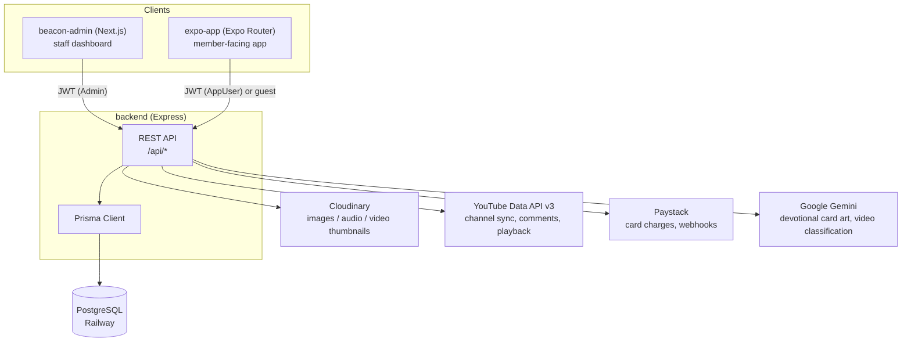

# The Beacon Centre

Monorepo for The Beacon Centre's digital platform:

| Directory | What it is | Stack |
| --- | --- | --- |
| [`backend/`](./backend) | REST API — content, giving, CSGs, notifications, auth | Express, Prisma, PostgreSQL |
| [`beacon-admin/`](./beacon-admin) | Admin dashboard for staff | Next.js |
| [`expo-app/`](./expo-app) | The mobile app | Expo Router (React Native) |
| [`docs/`](./docs) | Privacy policy & terms (GitHub Pages) | Static HTML |

Guest-first: sermons, devotionals, live service, audio, and CSG info all work with no account. An account (email + a 4–6 digit passcode, not a password) is only needed to save content, join a CSG, or give.

---

## Architecture

One backend, two clients. Neither `beacon-admin` nor `expo-app` talks to the database directly — everything goes through the same REST API.

### `backend/` — Express + Prisma + PostgreSQL

Single source of truth for every piece of content and every write. Structured as controller → service → Prisma, one triplet per resource (`videoSermon`, `audioSermon`, `devotional`, `csg`, `giving`, `prayerRequest`, `contact`, `collage`, `liveSchedule`, `notify`, …). `backend/src/config/database.ts` holds one `PrismaClient` singleton; every service imports `{ prisma }` from there rather than instantiating its own.

Two independent auth systems live side by side in the same API, because they authenticate two different kinds of actor:

- **Admin auth** (`middleware/auth.middleware.ts`) — staff. Email + password, `SUPER_ADMIN` / `CSG_ADMIN` roles, short-lived access token + refresh token pair. `CSG_ADMIN` is scoped to their own `csgId` server-side, not just hidden in the UI.
- **AppUser auth** (`middleware/user.middleware.ts`) — mobile end users. Email + name + 4–6 digit passcode (bcrypt-hashed), one long-lived JWT (no refresh flow — the session is meant to persist until the user explicitly signs out). The same middleware also still accepts a Firebase ID token as a fallback path, checked first against the app's own JWT and only falling through to Firebase verification if that fails — kept for a legacy flow that isn't wired into the current mobile app.

Most read endpoints (sermons, devotionals, announcements, CSG list, live schedule) are public — the mobile app calls them with no token at all as a guest. Endpoints that write data as a specific person (`/api/users/me/*` saves/notes/progress, CSG join/leave, giving history) require an AppUser token. Everything under `/api/admin/*` and the content-management routes require an Admin token.

Outbound integrations, all called from the backend only (neither client holds these credentials):

- **Cloudinary** — every image, audio file, and generated thumbnail is uploaded and served from here.
- **YouTube Data API v3** — the admin's "Sync from YouTube" pulls the whole channel, classifies each video with Gemini (full message vs. Short vs. standalone clip), and detects Shorts by checking whether `youtube.com/shorts/{id}` actually serves the Shorts player rather than redirecting — more reliable than a duration guess.
- **Paystack** — card charges for giving, verified both client-side (`/giving/verify`) and via webhook, so a closed app mid-payment doesn't lose the transaction.
- **Google Gemini** — generates the devotional card background image from the day's verse, and classifies synced videos. A pool of API keys rotates on rate-limit (429) responses.

Deployed on **Railway**, same project as the Postgres database, referencing it over Railway's private network rather than the public proxy.

### `beacon-admin/` — Next.js

Talks to the backend exclusively through `src/lib/api.ts`, an axios instance carrying the admin's JWT in an `Authorization` header, with a response interceptor that refreshes the access token on a 401 and retries once. No direct database access, no Prisma — if a page needs data, it's because there's a backend endpoint for it. Most content forms (video sermons, audio sermons, devotionals, announcements, CSGs, projects) follow the same shape: React Hook Form + Zod validation → `lib/api.ts` call → React Query cache invalidation. A few simpler ones (bank accounts) use plain component state instead.

### `expo-app/` — Expo Router

Same pattern as the admin: all data access goes through `services/api.ts` (public content) and `config/api.ts` (the shared axios instance + envelope-unwrapping helpers), never Prisma or the database directly. Guests get an unauthenticated client; signing in attaches the AppUser JWT the same way the admin attaches its own. Guest-only local state (onboarding completion, download preferences, notification prefs) lives in `AsyncStorage` under `guest:*` keys, independent of the account system, so nothing is lost if someone never creates an account.

---

## Mobile app design system

Source of truth for the tokens below: [`expo-app/theme/index.ts`](./expo-app/theme/index.ts) — read directly from the code, not a separate spec that can drift from it. The rationale behind the choices is design work done separately (see `Beacon Centre mobile app design/`); summarized here so it isn't lost as a pile of unread HTML.

### Design philosophy

> Most church apps are a sermon archive with a donate button — used once on Sunday, then forgotten.

The app is built around a member's week, not the database's table names: a verse in the morning, a Short on the bus, a CSG meeting on Thursday, giving whenever it's on your heart — rather than tabs that just mirror content types.

**One accent, used deliberately.**
- **Teal `#41BBAC`** is the only accent color in the app — it marks the one actionable thing on a screen and every progress fill. Text on light backgrounds drops to `#1C6462` for contrast.
- **Magenta `#CB3CA0`** appears in exactly two places in the entire app: the verse-of-the-day card on Home, and the verse block in the devotional reader. Nowhere else. Reserving it that tightly is what makes it register as meaningful rather than decorative.
- **Ink `#12100F`** carries the structural work — chrome, nav, secondary actions — that color usually gets asked to do, so teal doesn't have to.
- **Paper `#F3F1EC` / white** is the ground under 90% of every screen, so teal has somewhere to land instead of competing with other saturated colors.
- A single glow effect is used once, on one word ("*light*", the church's theme word) — not a general glassmorphic surface or hover treatment. Restraint is the point: three earlier, louder passes at this design (the full category palette — sky, amber, coral — from the original codebase) all made the app feel busier and worse.

**Two type families, one job each.** Plus Jakarta Sans (extra-bold, tight tracking) for UI. Instrument Serif appears only around scripture, so a verse reads as a distinct voice without needing a decorative flourish anywhere else.

**Every phone, no device branching.** No `Platform.OS === '...'` layout branch anywhere in the app. Three mechanisms cover a 360dp Galaxy A-series through an iPhone 15 Pro Max to an unfolded tablet: the clamped `0.86×`–`1.3×` responsive scale (below), real safe-area insets resolved from one call (notch, Dynamic Island, punch-hole, gesture bar, 3-button nav), and a 520dp content-width cap so wide viewports get a centered column instead of stretched phone UI.

**Signing up is optional — all of it.** Sermons, live service, announcements, the devotional, and giving all work with no account. An account buys exactly one thing: sync. Guest actions write to local storage under `guest:*` keys, and signing in later hands them over — a first-time visitor should never hit a wall before they've met the church.

### Color

| Token | Hex | Use |
| --- | --- | --- |
| `ground` | `#F3F1EC` | Screen background |
| `surface` | `#FFFFFF` | Cards |
| `surfaceAlt` | `#EFEDE7` | Secondary surface |
| `ink` | `#12100F` | Primary text |
| `inkSoft` | `#4A4640` | Secondary text |
| `muted` | `#6B665F` | Tertiary text |
| `faint` | `#857F77` | Placeholder / disabled text |
| `hairline` | `#F0EDE7` | Dividers |
| `border` | `#DFDACF` | Input / card borders |
| `teal` | `#41BBAC` | Brand accent |
| `tealDeep` | `#1C6462` | Brand accent, pressed/emphasis |
| `tealInk` | `#04211B` | Text on teal |
| `tealDark` | `#0E3B38` | Dark brand surface (splash, adaptive icon bg) |
| `tealPale` | `#E4F6F3` | Tinted teal background |
| `tealLight` | `#7FD8CC` | Light teal accent |
| `verse` | `#CB3CA0` | Verse-of-the-day card only — reserved, not reused elsewhere |
| `verseLift` | `#E572C0` | Verse card decorative accent |
| `verseGlow` | `#FFF6C4` | Verse card highlight |
| `live` | `#FF3B30` | Live badge, Shorts badge — reserved |
| `danger` | `#D93025` | Destructive actions |
| `onDark` | `#F3F1EC` | Text on dark/photo surfaces |
| `onDarkMuted` | `#8A857D` | Secondary text on dark surfaces |

`verse` (magenta) and `live` (red) are intentionally scoped to one surface each — they don't get reused as general-purpose accents.

### Typography

Plus Jakarta Sans for UI, Instrument Serif for devotional/quote content.

| Token | Font |
| --- | --- |
| `regular` | PlusJakartaSans_400Regular |
| `medium` | PlusJakartaSans_500Medium |
| `semibold` | PlusJakartaSans_600SemiBold |
| `bold` | PlusJakartaSans_700Bold |
| `extra` | PlusJakartaSans_800ExtraBold |
| `serif` | InstrumentSerif_400Regular |

### Spacing & responsive scale

Every size in the app runs through the responsive layer rather than a fixed pixel value. Baseline viewport is 390×844 (iPhone 13/14/15 logical points), scaled and clamped so small phones (Galaxy A-series, 360dp) don't feel cramped and tablets don't feel comical.

| Helper | Purpose |
| --- | --- |
| `s(n)` | Horizontal / general scale |
| `vs(n)` | Vertical scale (screen-height-relative sizing, e.g. hero images) |
| `ms(n, f=0.5)` | Moderate scale — grows at half rate, used for spacing that needs to track type |
| `fs(n, f=0.5)` | Font size — `ms()` plus the OS accessibility text-scale, capped at 1.25× so large system text settings don't break layout |

Screens call `useResponsive()` (subscribes to `useWindowDimensions`) so foldables unfolding, tablets rotating, or Android split-screen re-render with fresh numbers instead of stale module-level constants.

### Radius

| Token | Value |
| --- | --- |
| `xs` | `s(8)` |
| `sm` | `s(12)` |
| `md` | `s(16)` |
| `lg` | `s(20)` |
| `xl` | `s(24)` |
| `xxl` | `s(28)` |
| `pill` | `999` |

### Touch targets

`HIT` — 44pt on iOS (Apple HIG minimum), 48dp on Android (Material minimum).

### Shadow

Two elevation levels, platform-specific (iOS shadow properties, Android `elevation`):

- `shadow.card` — subtle, for resting cards (6% opacity, 18pt blur on iOS / elevation 2 on Android)
- `shadow.float` — pronounced, for floating/overlaid elements (18% opacity, 24pt blur on iOS / elevation 10 on Android)

---

## Legal

- [Privacy Policy](https://dbisina.github.io/The-beacon-centre/privacy-policy.html)
- [Terms of Service](https://dbisina.github.io/The-beacon-centre/terms.html)
